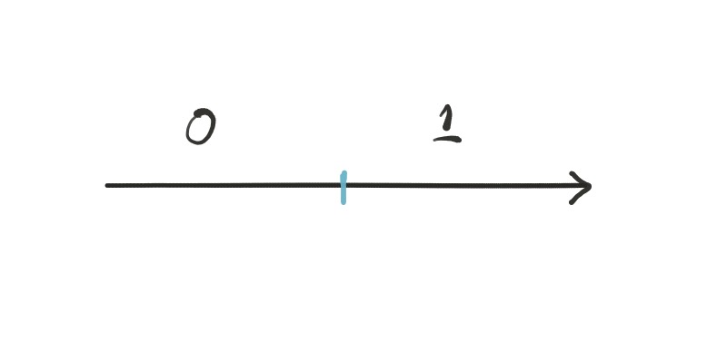
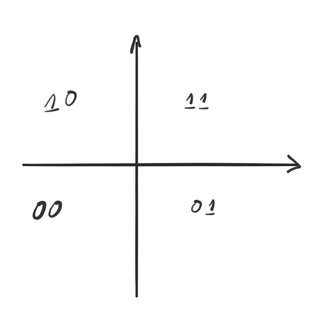
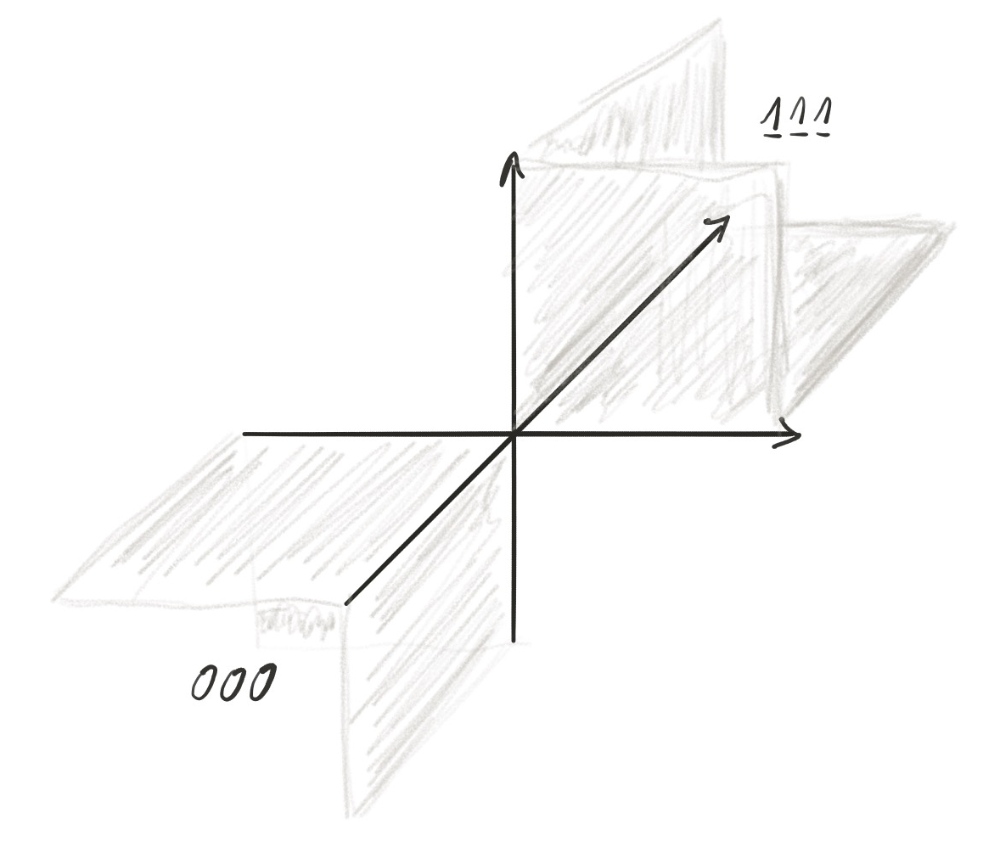
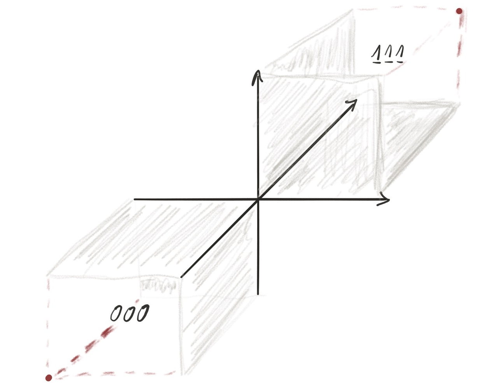
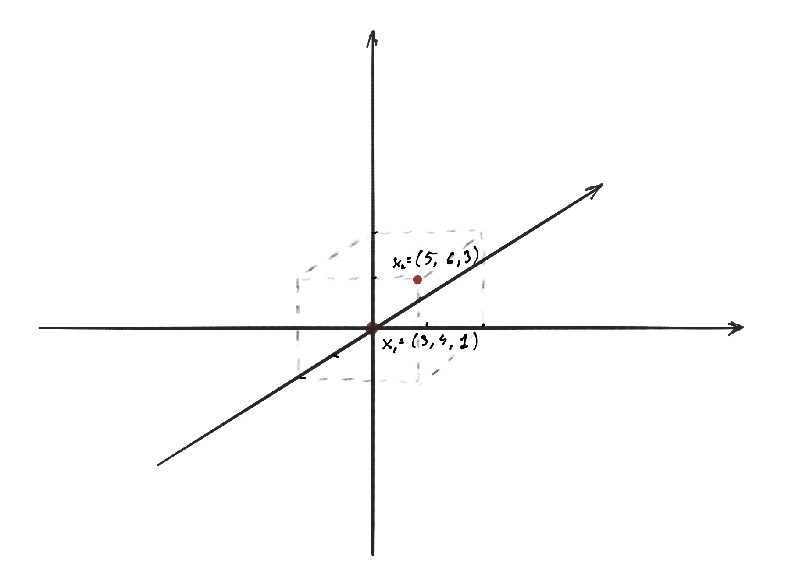

### Assumption

For simplicity we are assuming that the points are generated from continous distribution. In other words 
we are assuming that there is no ties in any given dimension for all random vectors in data set. The
further work is needed to extend presented below concept in order to account for ties.

### Quarter Indexing 

Lets assume that we have a one dimensional space. Graphically we can represent it as a line with defined 0.
We have two halves and we can use binary system to indicate each halve. Positive numbers are indicated by 1 and
negative numbers are indicated by 0. 

```{r, out.width = "200px", echo=FALSE}

```

When we increease number of dimensions by one we have a plane devided into four quarters and we need two binary 
numbers to index all quarters. 

```{r, out.width = "200px", echo=FALSE}

```

In the case of the three dimensional space we have eight "quarters" and we can index all quarters with three binary numbers.

```{r, out.width = "200px", echo=FALSE}

```

The rule for indexing quarter is rather obvious. First we observe that the number of "Quarters" is equal to $2^d$, where
d represents number of dimenstions. For each of the dimesions the value can be either bigger or smaller than zero (for 
now we will ingore case when value is 0). Therefore we need one bit per each dimension to index position of the point in
$d$ dimensial space. It is worth to notice that the index starts from 0 and ends at $2^d-1$

Furthermore it is important to notice that for each "quarter", there is an oposite "quarter"" indicated by the oposite vector
to a vector indicating point in a given quarter. By the nature of the binary indexing we can find the oposite quarter by performing the NOT operation on binary sequence indicating a given quarter. For a quarter marked by binary sequence $111$ (7 as an integer) the oposite quarter has index $000$ (0 as an integer).

For the sake of simplicity we will refer to the two oposite quarters as a direction. So in $d$ dimensional space we have $2^{d-1}$ directions as per each direction we need two quarters. 

```{r, out.width = "200px", echo=FALSE}

```

### Locating two points in reference to eachother (identifying a quarter)

Using "quarter indexing"" is an useful scheme. The scheme allows to identify relational position of two points 
in a multidimensional space by indicating a direction. As an example lets assume that we can have to vectors $\vec{x_1},\vec{x_2}$ indicating two points in the euclidan space.

If we want to define position of of $x_2$ in reference to $x_1$ we have to execute following operations:

1. $x_q=x_2-x_1$

2. Replace all positive values in $x_q$ with 1 and all negative values with 0

3. Translate binary sequence computed in previous step to decimal number

As an example we will use $x_1=(3, 4, 1)^T$ and $x_2=(5, 6, 3)^T$. First we subtract vectors $x_q=x_2-x_1 = (2,2,2)^T$. Then we create binary sequence applying rule listed in step two, so we have binary sequence $111$. Finally we translate binary sequnce to decimal number and we get 7th quarter. So we can conclude that point $x_2$ is located in 7-th quarter in reference to point $x_1$. 
By analogy if we check location of the point $x_1$ in reference to $x_2$ we will get quarter number 0 and we can conclude that the point $x_1$ is located in 0-th qarter in reference to point $x_2$.

```{r, out.width = "300px", echo=FALSE}

```

### Expressing Kendel's tau in terms of number of "quarters"

Interestingly, assuming that distribution is continous, we can express Kendel's tau estimator using introduced above quarter concept. Kendal's tau estimator is expreseed as follows:

(1)

$$
A_{ij}=sgn(X_i-X_j)*sgn(Y_i-Y_j) 
$$ 

where

(2)

$$
  sgn(u)=\begin{cases}
    1, & \text{if $u>0$}\\
    0, & \text{if $u>0$}\\
    -1, & \text{if $u<0$}
  \end{cases}
$$

(3)

$$
  T=\frac{\sum_{i=1}^{i=n-1}\sum_{j=i+1}^{j=n} A_{ij}}{\binom{n}{2}}
$$ 

To see how we can use quarter concept to estimate T, we have to recognize the fact that the formula nr 1 returns 1 for quarters 0 (00) and 3 (11) and returns -1 for quarters 1 (01) and 2 (10). Therefore we can interpret the nominator from the formula number (3) as a difference out of all possible pairs of points, between number pairs having other point in quarters 0 or 3, and pairs having other point in quarter 1 or 2. 

### Short discussion

Using concept of direction we can compute, out of all posible pairs, the number of points having
other point in a given direction and devide it by the number of all possible pairs.
The computed number would represent probability that a given pair of points will establish a given direction.
Intuitive speculation is that directions are independent (they are orthogonal to eachother) and thereofore
having vector of probabilites for each direction would reveal the nature of dataset in terms of monotnicity.

Furthermore if we assume that under $H_0$ there is no monotonicity present we know that for each pair, each of the direction is 
eqally likely. Threfore we know the probability distribution under $H_0$. So we can construct a test an compute the p-value
for the vector of probabilites computed based on a given sample. Assuming that this pass the review the further work is 
necessary to construct the proper test.

Other aspect worth further investigation is to the problem of interpretation. Resulting vector of probabilites is a weak indicator,
meaning one has to put allot of effort to build intuition to interpret properly computed vector of probabilites. In other words the utility of the propose method is low. Therefore more work has to be done on making computed results more intuition firendly.


### Performance against artificial dataset

In this section we will perfome computetion to conform the describe above approach. For that purpose we have generated four diffrent data sets
using correlation matrix. For each of those generated data sets we are adding a new data set where exponential transformation on the Z component
has been applied. To present our findings we will have following for each generated dataset:

1. Correlation matrix used to generate the data set.
2. Transformation applied  to "Z" component.
3. Scaterr plot ilustrating the generated data set and transformed data set.
4. 3D plot of data set and transformed data set.
5. Correlation matrix for both data sets.
6. Counts and respect probabilities for each direction for both data sets. 

### Data set 1 - Highly Correlated


```{r, echo=FALSE}
R = matrix(cbind(1.000000, -0.7, 0.951929,  
                 -0.7, 1.0000, -0.550000,  
                 0.951929, -0.5500, 1.000000),
           nrow=3)

# R = matrix(cbind(1.000000, -0.34321, 0.951929,  
#                  -0.34321, 1.0000, -0.550000,  
#                  0.951929, -0.5500, 1.000000),
#            nrow=3)

# R = matrix(cbind(1.000000, 0.1121, 0.851929,  
#                  0.112100, 1.0000, 0.140000,  
#                  0.851929, 0.1400, 1.000000),
#            nrow=3)

# R = matrix(cbind(1.0000, 0.00, 0.00,  
#                  0.00, 1.0000, 0.00,  
#                  0.00, 0.00, 1.0000),
#            nrow=3)
 
U = t(chol(R))
nvars = dim(U)[1]
numobs = 100
set.seed(1)
random.normal = matrix(rnorm(nvars*numobs,0,1), nrow=nvars, ncol=numobs);
X = U %*% random.normal
newX = t(X)
newXT = t(X)

#Turn expotential transformation
newXT[,3] <- exp(newX[,3])

#Ignore generated data and put hyperplane instead
# newX[,1]<-seq(1:100)
# newX[,2]<-(-seq(1:100))
# newX[,3]<-seq(1:100)

```

### Input Correlation Matrix 

```{r, echo=FALSE}
R.df = as.data.frame(R)
names(R.df) = c("X","Y","Z")
R.df
```

### Scatter plot for generated data

```{r, echo=FALSE}
newX.df = as.data.frame(newX)
names(newX.df) = c("X","Y","Z")
plot(head(newX.df, numobs), main="Data set scatterplot")
```

```{r, echo=FALSE}
newXT.df = as.data.frame(newXT)
names(newXT.df) = c("X","Y","Z")
plot(head(newXT.df, numobs), main="Data set scatterplot with Z replaced by exp(Z)")
```

### 3D plot

```{r, echo=FALSE}
library(scatterplot3d)

scatterplot3d(newX.df$X, newX.df$Y, newX.df$Z, highlight.3d=TRUE, xlab="X", ylab="Y", zlab="Z",
 col.axis="blue", col.grid="lightblue",
 main="Scatterplot3d - Data Set 1", pch=20)
```

```{r, echo=FALSE}
scatterplot3d(newXT.df$X, newXT.df$Y, newXT.df$Z, highlight.3d=TRUE, xlab="X", ylab="Y", zlab="Z",
 col.axis="blue", col.grid="lightblue",
 main="Scatterplot3d - Data set with Z replaced by exp(Z)", pch=20)
```

```{r, echo=FALSE}
bintodec <- function(y) {
  # find the decimal number corresponding to binary sequence 'y'
  if (! (all(y %in% c(0,1)))) stop("not a binary sequence")
  res <- sum(y*2^((length(y):1) - 1))
  return(res)
}

computeKendalProbVect <- function(newX) {
  qrtCount = rep(0, 2^(nvars-1))
  for(i in 1:(numobs-1)) {
    for(k in (i+1):numobs) {
      dx =  newX[k,] - newX[i,]
      p = as.integer(dx > 0)
      if (p[1] == 1) 
        p = (p != 1) ##Operation NOT to compute direction vs quarters (most significant bit is 0)
      p = bintodec(p)
      qrtCount[p+1] = qrtCount[p+1] + 1
    }
  }
  return(qrtCount)
}

qrtCountNoTrnsf <- computeKendalProbVect(newX)
qrtCount <- computeKendalProbVect(newXT)
```

### Counts and Probabilities depending on the quarter for the data set

```{r, echo=FALSE}

qrtProbNoTrnsf = qrtCountNoTrnsf/choose(numobs, 2)

#Construct a matrix of Counts and Probabilities
C=as.matrix=cbind(qrtCountNoTrnsf,qrtProbNoTrnsf)
colnames(C)<-c("Count per direction", "Probability per direction")
```


```{r results='asis', echo=FALSE}
df <- as.data.frame(t(C))
names(df)[names(df) == 'V1'] <- paste(tail(rev(as.integer(intToBits(0))),2),collapse = "")
names(df)[names(df) == 'V2'] <- paste(tail(rev(as.integer(intToBits(1))),2),collapse = "")
names(df)[names(df) == 'V3'] <- paste(tail(rev(as.integer(intToBits(2))),2),collapse = "")
names(df)[names(df) == 'V4'] <- paste(tail(rev(as.integer(intToBits(3))),2),collapse = "")


library(knitr)
out <- kable(df,format="markdown", align = 'c')
cat(gsub('\\bNaN\\b', '  ', out), sep='\n')
```

### Counts and Probabilities depending on the quarter for the data set with Z replaced by exp(Z)

```{r, echo= FALSE}

qrtProb = qrtCount/choose(numobs, 2)


#Construct a matrix of Counts and Probabilities
B=as.matrix=cbind(qrtCount,qrtProb)
colnames(B)<-c("Count per direction", "Probability per direction")

```

```{r results='asis', echo=FALSE}
df <- as.data.frame(t(B))
names(df)[names(df) == 'V1'] <- paste(tail(rev(as.integer(intToBits(0))),2),collapse = "")
names(df)[names(df) == 'V2'] <- paste(tail(rev(as.integer(intToBits(1))),2),collapse = "")
names(df)[names(df) == 'V3'] <- paste(tail(rev(as.integer(intToBits(2))),2),collapse = "")
names(df)[names(df) == 'V4'] <- paste(tail(rev(as.integer(intToBits(3))),2),collapse = "")


library(knitr)
out <- kable(df,format="markdown", align = 'c')
cat(gsub('\\bNaN\\b', '  ', out), sep='\n')
```

```{r, echo=FALSE}
print("Computed Pearson Correlation for the data set (no transformation)")
cor(newX)
```

```{r, echo=FALSE}
print("Computed Pearson Correlation for the data set with Z replaced by exp(Z)")
cor(newXT)
```

As we can see the Counts and Probabilites computed for both data sets (with no transformation and with transformation) are 
the same. However the computed with Pearson method correlation is lower for the data set where Z component has been replaced with exp(Z). 


### Data set 2 - No correlation

```{r, echo=FALSE}
R = matrix(cbind(1.0000, 0.00, 0.00,
                 0.00, 1.0000, 0.00,
                 0.00, 0.00, 1.0000),
           nrow=3)
 
U = t(chol(R))
nvars = dim(U)[1]
numobs = 100
set.seed(1)
random.normal = matrix(rnorm(nvars*numobs,0,1), nrow=nvars, ncol=numobs);
X = U %*% random.normal
newX = t(X)
newXT = t(X)

#Turn expotential transformation
newXT[,3] <- exp(newX[,3])

#Ignore generated data and put hyperplane instead
# newX[,1]<-seq(1:100)
# newX[,2]<-(-seq(1:100))
# newX[,3]<-seq(1:100)

```

### Input Correlation Matrix 

```{r, echo=FALSE}
R.df = as.data.frame(R)
names(R.df) = c("X","Y","Z")
R.df
```

### Scatter plot for generated data

```{r, echo=FALSE}
newX.df = as.data.frame(newX)
names(newX.df) = c("X","Y","Z")
plot(head(newX.df, numobs), main="Data set scatterplot")
```

```{r, echo=FALSE}
newXT.df = as.data.frame(newXT)
names(newXT.df) = c("X","Y","Z")
plot(head(newXT.df, numobs), main="Data set scatterplot with Z replaced by exp(Z)")
```

### 3D plot

```{r, echo=FALSE}
library(scatterplot3d)

scatterplot3d(newX.df$X, newX.df$Y, newX.df$Z, highlight.3d=TRUE, xlab="X", ylab="Y", zlab="Z",
 col.axis="blue", col.grid="lightblue",
 main="Scatterplot3d - Data Set 1", pch=20)
```

```{r, echo=FALSE}
scatterplot3d(newXT.df$X, newXT.df$Y, newXT.df$Z, highlight.3d=TRUE, xlab="X", ylab="Y", zlab="Z",
 col.axis="blue", col.grid="lightblue",
 main="Scatterplot3d - Data set with Z replaced by exp(Z)", pch=20)
```

```{r, echo=FALSE}
bintodec <- function(y) {
  # find the decimal number corresponding to binary sequence 'y'
  if (! (all(y %in% c(0,1)))) stop("not a binary sequence")
  res <- sum(y*2^((length(y):1) - 1))
  return(res)
}

computeKendalProbVect <- function(newX) {
  qrtCount = rep(0, 2^(nvars-1))
  for(i in 1:(numobs-1)) {
    for(k in (i+1):numobs) {
      dx =  newX[k,] - newX[i,]
      p = as.integer(dx > 0)
      if (p[1] == 1) 
        p = (p != 1) ##Operation NOT to compute direction vs quarters (most significant bit is 0)
      p = bintodec(p)
      qrtCount[p+1] = qrtCount[p+1] + 1
    }
  }
  return(qrtCount)
}

qrtCountNoTrnsf <- computeKendalProbVect(newX)
qrtCount <- computeKendalProbVect(newXT)
```

### Counts and Probabilities depending on the quarter for the data set

```{r, echo=FALSE}

qrtProbNoTrnsf = qrtCountNoTrnsf/choose(numobs, 2)

#Construct a matrix of Counts and Probabilities
C=as.matrix=cbind(qrtCountNoTrnsf,qrtProbNoTrnsf)
colnames(C)<-c("Count per direction", "Probability per direction")
```


```{r results='asis', echo=FALSE}
df <- as.data.frame(t(C))
names(df)[names(df) == 'V1'] <- paste(tail(rev(as.integer(intToBits(0))),2),collapse = "")
names(df)[names(df) == 'V2'] <- paste(tail(rev(as.integer(intToBits(1))),2),collapse = "")
names(df)[names(df) == 'V3'] <- paste(tail(rev(as.integer(intToBits(2))),2),collapse = "")
names(df)[names(df) == 'V4'] <- paste(tail(rev(as.integer(intToBits(3))),2),collapse = "")


library(knitr)
out <- kable(df,format="markdown", align = 'c')
cat(gsub('\\bNaN\\b', '  ', out), sep='\n')
```

### Counts and Probabilities depending on the quarter for the data set with Z replaced by exp(Z)

```{r, echo= FALSE}

qrtProb = qrtCount/choose(numobs, 2)


#Construct a matrix of Counts and Probabilities
B=as.matrix=cbind(qrtCount,qrtProb)
colnames(B)<-c("Count per direction", "Probability per direction")

```

```{r results='asis', echo=FALSE}
df <- as.data.frame(t(B))
names(df)[names(df) == 'V1'] <- paste(tail(rev(as.integer(intToBits(0))),2),collapse = "")
names(df)[names(df) == 'V2'] <- paste(tail(rev(as.integer(intToBits(1))),2),collapse = "")
names(df)[names(df) == 'V3'] <- paste(tail(rev(as.integer(intToBits(2))),2),collapse = "")
names(df)[names(df) == 'V4'] <- paste(tail(rev(as.integer(intToBits(3))),2),collapse = "")


library(knitr)
out <- kable(df,format="markdown", align = 'c')
cat(gsub('\\bNaN\\b', '  ', out), sep='\n')
```

```{r, echo=FALSE}
print("Computed Pearson Correlation for the data set (no transformation)")
cor(newX)
```

```{r, echo=FALSE}
print("Computed Pearson Correlation for the data set with Z replaced by exp(Z)")
cor(newXT)
```

As we can see the Counts and Probabilites computed for both data sets (with no transformation and with transformation) are 
the same. However the computed with Pearson method correlation is lower for the data set where Z component has been replaced with exp(Z). Also we can observed that respective probabilites for each direction are almost equal. This fact conforms with 
our intuition that for the uncorrelated data set any given direction is equally likely to occur.


### Data Set 3 - Perfect Correlation

```{r, echo=FALSE}
X1 = newX
X1[,1]<-seq(from=0.1, to=10, by = 0.1)
X1[,2]<-seq(from=0.1, to=10, by = 0.1)
X1[,3]<-seq(from=0.1, to=10, by = 0.1)
 
newX = X1
newXT = X1

#Turn expotential transformation
newXT[,3] <- exp(newX[,3])
```

### Input Correlation Matrix 

```{r, echo=FALSE}
R.df = as.data.frame(R)
names(R.df) = c("X","Y","Z")
R.df
```

### Scatter plot for generated data

```{r, echo=FALSE}
newX.df = as.data.frame(newX)
names(newX.df) = c("X","Y","Z")
plot(head(newX.df, numobs), main="Data set scatterplot")
```

```{r, echo=FALSE}
newXT.df = as.data.frame(newXT)
names(newXT.df) = c("X","Y","Z")
plot(head(newXT.df, numobs), main="Data set scatterplot with Z replaced by exp(Z)")
```

### 3D plot

```{r, echo=FALSE}
library(scatterplot3d)

scatterplot3d(newX.df$X, newX.df$Y, newX.df$Z, highlight.3d=TRUE, xlab="X", ylab="Y", zlab="Z",
 col.axis="blue", col.grid="lightblue",
 main="Scatterplot3d - Data Set 1", pch=20)
```

```{r, echo=FALSE}
scatterplot3d(newXT.df$X, newXT.df$Y, newXT.df$Z, highlight.3d=TRUE, xlab="X", ylab="Y", zlab="Z",
 col.axis="blue", col.grid="lightblue",
 main="Scatterplot3d - Data set with Z replaced by exp(Z)", pch=20)
```

```{r, echo=FALSE}
bintodec <- function(y) {
  # find the decimal number corresponding to binary sequence 'y'
  if (! (all(y %in% c(0,1)))) stop("not a binary sequence")
  res <- sum(y*2^((length(y):1) - 1))
  return(res)
}

computeKendalProbVect <- function(newX) {
  qrtCount = rep(0, 2^(nvars-1))
  for(i in 1:(numobs-1)) {
    for(k in (i+1):numobs) {
      dx =  newX[k,] - newX[i,]
      p = as.integer(dx > 0)
      if (p[1] == 1) 
        p = (p != 1) ##Operation NOT to compute direction vs quarters (most significant bit is 0)
      p = bintodec(p)
      qrtCount[p+1] = qrtCount[p+1] + 1
    }
  }
  return(qrtCount)
}

qrtCountNoTrnsf <- computeKendalProbVect(newX)
qrtCount <- computeKendalProbVect(newXT)
```

### Counts and Probabilities depending on the quarter for the data set

```{r, echo=FALSE}

qrtProbNoTrnsf = qrtCountNoTrnsf/choose(numobs, 2)

#Construct a matrix of Counts and Probabilities
C=as.matrix=cbind(qrtCountNoTrnsf,qrtProbNoTrnsf)
colnames(C)<-c("Count per direction", "Probability per direction")
```


```{r results='asis', echo=FALSE}
df <- as.data.frame(t(C))
names(df)[names(df) == 'V1'] <- paste(tail(rev(as.integer(intToBits(0))),2),collapse = "")
names(df)[names(df) == 'V2'] <- paste(tail(rev(as.integer(intToBits(1))),2),collapse = "")
names(df)[names(df) == 'V3'] <- paste(tail(rev(as.integer(intToBits(2))),2),collapse = "")
names(df)[names(df) == 'V4'] <- paste(tail(rev(as.integer(intToBits(3))),2),collapse = "")


library(knitr)
out <- kable(df,format="markdown", align = 'c')
cat(gsub('\\bNaN\\b', '  ', out), sep='\n')
```

### Counts and Probabilities depending on the quarter for the data set with Z replaced by exp(Z)

```{r, echo= FALSE}

qrtProb = qrtCount/choose(numobs, 2)


#Construct a matrix of Counts and Probabilities
B=as.matrix=cbind(qrtCount,qrtProb)
colnames(B)<-c("Count per direction", "Probability per direction")

```

```{r results='asis', echo=FALSE}
df <- as.data.frame(t(B))
names(df)[names(df) == 'V1'] <- paste(tail(rev(as.integer(intToBits(0))),2),collapse = "")
names(df)[names(df) == 'V2'] <- paste(tail(rev(as.integer(intToBits(1))),2),collapse = "")
names(df)[names(df) == 'V3'] <- paste(tail(rev(as.integer(intToBits(2))),2),collapse = "")
names(df)[names(df) == 'V4'] <- paste(tail(rev(as.integer(intToBits(3))),2),collapse = "")


library(knitr)
out <- kable(df,format="markdown", align = 'c')
cat(gsub('\\bNaN\\b', '  ', out), sep='\n')
```

```{r, echo=FALSE}
print("Computed Pearson Correlation for the data set (no transformation)")
cor(newX)
```

```{r, echo=FALSE}
print("Computed Pearson Correlation for the data set with Z replaced by exp(Z)")
cor(newXT)
```

As we can see the Counts and Probabilites computed for both data sets (with no transformation and with transformation) are 
the same. However the computed with Pearson method correlation is lower for the data set where Z component has been replaced with exp(Z). We can also observerd that only one direction is possible for this data set since the probability is equal 1 for one direction and 0 for all others.


#Appendix A - Source code for RStudio


### Data set 1 - Correlation between variables "X" and "Z"


```{r}

R = matrix(cbind(1.000000, 0.1121, 0.851929,
                 0.112100, 1.0000, 0.140000,
                 0.851929, 0.1400, 1.000000),
           nrow=3)

U = t(chol(R))
nvars = dim(U)[1]
numobs = 100
set.seed(1)
random.normal = matrix(rnorm(nvars*numobs,0,1), nrow=nvars, ncol=numobs);
X = U %*% random.normal
newX = t(X)
newXT = t(X)

newXT[,3] <- exp(newX[,3])
```

### Input Correlation Matrix 

```{r}
R.df = as.data.frame(R)
names(R.df) = c("X","Y","Z")
R.df
```

### Scatter plot for generated data

```{r}
newX.df = as.data.frame(newX)
names(newX.df) = c("X","Y","Z")
plot(head(newX.df, numobs), main="Data set scatterplot")
```

```{r}
newXT.df = as.data.frame(newXT)
names(newXT.df) = c("X","Y","Z")
plot(head(newXT.df, numobs), main="Data set scatterplot with Z replaced by exp(Z)")
```

### 3D plot

```{r}
library(scatterplot3d)

scatterplot3d(newX.df$X, newX.df$Y, newX.df$Z, highlight.3d=TRUE, xlab="X", ylab="Y", zlab="Z",
 col.axis="blue", col.grid="lightblue",
 main="Scatterplot3d - Data Set 1", pch=20)
```

```{r}
scatterplot3d(newXT.df$X, newXT.df$Y, newXT.df$Z, highlight.3d=TRUE, xlab="X", ylab="Y", zlab="Z",
 col.axis="blue", col.grid="lightblue",
 main="Scatterplot3d - Data set with Z replaced by exp(Z)", pch=20)
```

```{r}
bintodec <- function(y) {
  # find the decimal number corresponding to binary sequence 'y'
  if (! (all(y %in% c(0,1)))) stop("not a binary sequence")
  res <- sum(y*2^((length(y):1) - 1))
  return(res)
}

computeKendalProbVect <- function(newX) {
  qrtCount = rep(0, 2^(nvars-1))
  for(i in 1:(numobs-1)) {
    for(k in (i+1):numobs) {
      dx =  newX[k,] - newX[i,]
      p = as.integer(dx > 0)
      if (p[1] == 1) 
        p = (p != 1) ##Operation NOT to compute direction vs quarters (most significant bit is 0)
      p = bintodec(p)
      qrtCount[p+1] = qrtCount[p+1] + 1
    }
  }
  return(qrtCount)
}

qrtCountNoTrnsf <- computeKendalProbVect(newX)
qrtCount <- computeKendalProbVect(newXT)
```

### Counts and Probabilities depending on the quarter for the data set

```{r}

qrtProbNoTrnsf = qrtCountNoTrnsf/choose(numobs, 2)

#Construct a matrix of Counts and Probabilities
C=as.matrix=cbind(qrtCountNoTrnsf,qrtProbNoTrnsf)
colnames(C)<-c("Count per direction", "Probability per direction")
```


```{r results='asis'}
df <- as.data.frame(t(C))
names(df)[names(df) == 'V1'] <- paste(tail(rev(as.integer(intToBits(0))),2),collapse = "")
names(df)[names(df) == 'V2'] <- paste(tail(rev(as.integer(intToBits(1))),2),collapse = "")
names(df)[names(df) == 'V3'] <- paste(tail(rev(as.integer(intToBits(2))),2),collapse = "")
names(df)[names(df) == 'V4'] <- paste(tail(rev(as.integer(intToBits(3))),2),collapse = "")


library(knitr)
out <- kable(df,format="markdown", align = 'c')
cat(gsub('\\bNaN\\b', '  ', out), sep='\n')
```

### Counts and Probabilities depending on the quarter for the data set with Z replaced by exp(Z)

```{r}

qrtProb = qrtCount/choose(numobs, 2)


#Construct a matrix of Counts and Probabilities
B=as.matrix=cbind(qrtCount,qrtProb)
colnames(B)<-c("Count per direction", "Probability per direction")

```

```{r results='asis'}
df <- as.data.frame(t(B))
names(df)[names(df) == 'V1'] <- paste(tail(rev(as.integer(intToBits(0))),2),collapse = "")
names(df)[names(df) == 'V2'] <- paste(tail(rev(as.integer(intToBits(1))),2),collapse = "")
names(df)[names(df) == 'V3'] <- paste(tail(rev(as.integer(intToBits(2))),2),collapse = "")
names(df)[names(df) == 'V4'] <- paste(tail(rev(as.integer(intToBits(3))),2),collapse = "")


library(knitr)
out <- kable(df,format="markdown", align = 'c')
cat(gsub('\\bNaN\\b', '  ', out), sep='\n')
```

```{r}
print("Computed Pearson Correlation for the data set (no transformation)")
cor(newX)
```

```{r}
print("Computed Pearson Correlation for the data set with Z replaced by exp(Z)")
cor(newXT)
```

